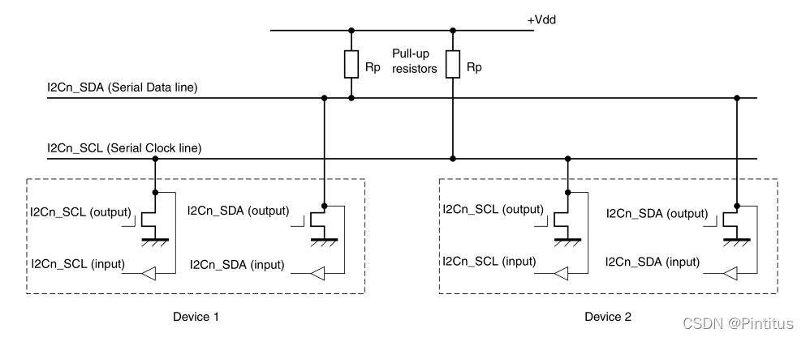
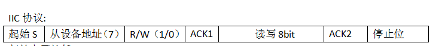
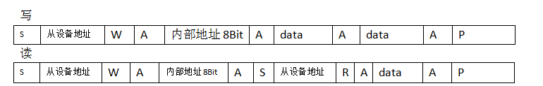

# Linux驱动之i2c驱动

Linux驱动之i2c驱动_Pintitus的博客-CSDN博客_i2c驱动 - https://blog.csdn.net/Pintitus/article/details/122629813

### 一、I2C简介

 I2C是很常用的总线协议。它使用两条线在主控制器与从机直接进行数据通信。一条是时钟线，一条是数据线，两条数据线都要接4.7K的上拉电阻，空闲的时候处于高电平。I2C总线的标准模式下传输速度可以达到100k/s，快速模式达到400k/s。

 常见的I2C驱动从设备有电容触摸屏，CMOS camera ，重力传感器，EEPROM,HDMI。



### 二、I2C的协议内容

 起始位S：数据位电平拉低

 停止位P：数据位拉高



ACK1：MASTER发送完地址后，SLIVER将数据位拉低，响应主机。

 ACK2：读写完以后，主机拉低数据位，告诉SLIVER进行回应。



写数据：
 主机发送起始位S信号，发送i2c从机的地址，发送写位，ACK1，写入从机的寄存器的8位数据，然后循环写数据，最后从机ACK2应答，并且主机发送停止位信号。

读数据：
 写入设备地址，写入寄存器地址，读取设备地址，读取寄存器的值。

 阶段一：主机发送S，写入I2C设备地址，ACK1从机响应。

 阶段二：重发S，发送寄存器的地址，从机ACK1响应。

 阶段三：重发S，发送I2C设备地址，读位，ACK1响应。

 阶段四：读取数据，ACK2主机拉低信号读完8bit，主机发送P。

### 三、I2C子系统框架

分为应用层，驱动层与硬件层三层。

其中驱动层可分为三层:i2c_driver，i2c_core，i2c_adaptor。分别是驱动层，内核层以及适配器层。驱动层是设备的IO的驱动程序。内核层是将设备与驱动分离的两个链表，使得设备树信息与驱动程序进行匹配。适配器层是用于提供硬件协议的执行算法，一般由供应商提供。

### I2C相关的API：

```c
struct i2c_driver{
  int (*probe)(struct i2c_client * , const struct i2c_device_id *);
  int (*remove)(struct i2c_client *);
  struct device_driver driver;
  const struct i2c_device_id *id_table;
};
//注册与注销：
int i2c_add_driver(struct i2c_driver *driver)；
void i2c_del_driver(struct i2c_driver *driver);

//发送接收消息
int i2c_master_send(const struct i2c_client *client, const char *buf, int count);
int i2c_master_recv(const struct i2c_client *client, char *buf, int count);

struct i2c_client {
	unsigned short addr;	//从设备地址，来源于设备树中的reg = <0x68>
	char name[I2C_NAME_SIZE];	//用于与i2c_driver进行匹配的compatible信息
    struct i2c_adapter *adapter;
    struct device dev;
};

//创建i2c_client的函数
struct i2c_client * i2c_new_device(struct i2c_adapter *adap , struct i2c_board_info const *info);
```

 其中i2c_client相当于设备数中的i2c结点的信息，i2c_adapter相当于设备树中i2c总线上挂在的设备的信息。因此我们在后面编写读写程序的时候会将i2c_client中的信息传递给i2c_adapter。

```dts
&i2c1 {
	//i2c_client
	clock-frequency = <100000>;
	pinctrl-names = "default";
	pinctrl-0 = <&pinctrl_i2c1>;
	status = "okay";

	mpu6050@68 {
        //i2c_adapter
		compatible = "mpu6050,INV_MPU6050";
		reg = <0x68>;
	};
};
```

### I2C读写信息实现：

 I2C的收发其实是使用i2c_transfer函数实现的。唯一的不同点是i2c_msg结构体的flags中读是1，写是0。

```C
/**
 * i2c_master_send - issue a single I2C message in master transmit mode
 * @client: Handle to slave device
 * @buf: Data that will be written to the slave
 * @count: How many bytes to write, must be less than 64k since msg.len is u16
 *
 * Returns negative errno, or else the number of bytes written.
 */
int i2c_master_send(const struct i2c_client *client, const char *buf, int count)
{
	int ret;
	struct i2c_adapter *adap = client->adapter;
	struct i2c_msg msg;

	msg.addr = client->addr;
	msg.flags = client->flags & I2C_M_TEN;
	msg.len = count;
	msg.buf = (char *)buf;

	ret = i2c_transfer(adap, &msg, 1);

	/*
	 * If everything went ok (i.e. 1 msg transmitted), return #bytes
	 * transmitted, else error code.
	 */
	return (ret == 1) ? count : ret;
}
/**
 * i2c_master_recv - issue a single I2C message in master receive mode
 * @client: Handle to slave device
 * @buf: Where to store data read from slave
 * @count: How many bytes to read, must be less than 64k since msg.len is u16
 *
 * Returns negative errno, or else the number of bytes read.
 */
int i2c_master_recv(const struct i2c_client *client, char *buf, int count)
{
	struct i2c_adapter *adap = client->adapter;
	struct i2c_msg msg;
	int ret;

	msg.addr = client->addr;
	msg.flags = client->flags & I2C_M_TEN;
	msg.flags |= I2C_M_RD;
	msg.len = count;
	msg.buf = buf;

	ret = i2c_transfer(adap, &msg, 1);

	/*
	 * If everything went ok (i.e. 1 msg received), return #bytes received,
	 * else error code.
	 */
	return (ret == 1) ? count : ret;
}
```

在编写I2C驱动中我们一般是要对寄存器的数据进行读操作，因此就需要首先写入从设备地址，读取寄存器的数据。

```c
int i2c_read_reg(const struct i2c_client *client, char *buf, int reg , int count)
{
	struct i2c_adapter *adap = client->adapter;
	struct i2c_msg msg[2];
	char rxbuf[1];
	int ret;
	
	//写入寄存器地址
	msg[0].addr = client->addr;
	msg[0].flags = 0;
	msg[0].len = 1;
	msg[0].buf = &reg;
	
	//往寄存器读取数据
	msg[0].addr = client->addr;
	msg[0].flags = 1;
	msg[0].len = 1;
	msg[0].buf = rxbuf;

	ret = i2c_transfer(adap, &msg, 2);

	/*
	 * If everything went ok (i.e. 1 msg received), return #bytes received,
	 * else error code.
	 */
	return rxbuf[0];
}
```

### 四、MPU6050驱动程序

```C
#include <linux/init.h>
#include <linux/kernel.h>
#include <linux/module.h>
#include <linux/fs.h>
#include <linux/io.h>
#include <linux/ioctl.h>
#include <linux/device.h>
#include <linux/cdev.h>
#include <linux/of.h>
#include <linux/of_gpio.h>
#include <linux/gpio.h>
#include <linux/input.h>
#include <linux/platform_device.h>
#include <linux/compaction.h>
#include <linux/irq.h>
#include <linux/irqreturn.h>
#include <linux/uaccess.h>
#include <linux/interrupt.h>
#include <linux/fcntl.h>
#include <linux/sh_clk.h>
#include <linux/i2c.h>


#include <linux/delay.h>
#include <linux/slab.h>

#include "mpu6050.h"


struct mpu6050_device{
	struct i2c_client *mpu6050_client;
    struct cdev cdev;
    int major;
    struct class *class;
    struct device *dev;
};
static struct mpu6050_device *mpu6050;

static int mpu6050_read_byte (struct i2c_client *client, char *buf, int count)
{
    int ret;
    struct i2c_adapter *adapter = client->adapter;
    struct i2c_msg msg;
    
    msg.addr = client->addr;
    msg.flags = 1;
    msg.len = count;
    msg.buf = buf;

	ret = i2c_transfer(adapter,&msg,1);//num是消息的个数
    return (ret == 1) ? count : ret;
}


static int mpu6050_write_byte (struct i2c_client *client, char *buf, int count)
{
    int ret;
    struct i2c_adapter *adapter = client->adapter;
    struct i2c_msg msg;
    
    msg.addr = client->addr;
    msg.flags = 0;
    msg.len = count;
    msg.buf = buf;

	ret = i2c_transfer(adapter,&msg,1);//num是消息的个数
    return (ret == 1) ? count : ret;
}

static int mpu6050_read_reg_byte(struct i2c_client *client, char reg)
{
    int ret;
    struct i2c_adapter *adapter = client->adapter;
    struct i2c_msg msg[2];
    char rxbuf[1];
    
    //先写reg寄存器地址
    msg[0].addr = client->addr;
    msg[0].flags = 0;   //W
    msg[0].len = 1;
    msg[0].buf = &reg;

    //读取寄存器的数据
    msg[1].addr = client->addr;
    msg[1].flags = 1;   //R
    msg[1].len = 1;
    msg[1].buf = rxbuf;

	ret = i2c_transfer(adapter,msg,2);//num是消息的个数
    if(ret < 0){
        printk("i2c_transfer read reg error\r\n");
        return ret;
    }

    return rxbuf[0];
}

static int mpu6050_ioctl(struct file *file, unsigned int cmd,unsigned long arg)
{

    struct mpu6050_data data;
	struct i2c_client *client = mpu6050->mpu6050_client;

	switch(cmd) {
        case IOC_GET_ACCEL:
            printk("IOC_GET_ACCEL \r\n");
            data.accel.x = mpu6050_read_reg_byte(client, ACCEL_XOUT_L);
            data.accel.x |= mpu6050_read_reg_byte(client, ACCEL_XOUT_H) << 8;

            data.accel.y = mpu6050_read_reg_byte(client, ACCEL_YOUT_L);
            data.accel.y |= mpu6050_read_reg_byte(client, ACCEL_YOUT_H) << 8;

            data.accel.z = mpu6050_read_reg_byte(client, ACCEL_ZOUT_L);
            data.accel.z |= mpu6050_read_reg_byte(client, ACCEL_ZOUT_H) << 8;
            break;

        case IOC_GET_GYRO:
            printk("IOC_GET_GYRO \r\n");
            data.gyro.x = mpu6050_read_reg_byte(client, GYRO_XOUT_L);
            data.gyro.x |= mpu6050_read_reg_byte(client, GYRO_XOUT_H) << 8;

            data.gyro.y = mpu6050_read_reg_byte(client, GYRO_YOUT_L);
            data.gyro.y |= mpu6050_read_reg_byte(client, GYRO_YOUT_H) << 8;

            data.gyro.z = mpu6050_read_reg_byte(client, GYRO_ZOUT_L);
            data.gyro.z |= mpu6050_read_reg_byte(client, GYRO_ZOUT_H) << 8;
            break;

        case IOC_GET_TEMP:
            printk("IOC_GET_TEMP \r\n");
            data.temp = mpu6050_read_reg_byte(client, TEMP_OUT_L);
            data.temp |= mpu6050_read_reg_byte(client, TEMP_OUT_H) << 8;
            break;

        default:
            printk("invalid argument\n");
            return -EINVAL;
	}

	if (copy_to_user((void *)arg, &data, sizeof(data)))
		return -EFAULT;

	return 0;
}

/*字符设备操作函数集，open函数实现*/
static int mpu6050_open(struct inode *inode, struct file *filp){
    printk("--------------mpu6050_open-------------\r\n");
    /*向 mpu6050 发送配置数据，让mpu6050处于正常工作状态*/
    char buf[2] = {PWR_MGMT_1 , 0x0};
    mpu6050_write_byte(mpu6050->mpu6050_client , buf, 2);
    char buf1[2] = {SMPLRT_DIV, 0x07};
    mpu6050_write_byte(mpu6050->mpu6050_client , buf1, 2);
    char buf2[2] = {CONFIG, 0X06};
    mpu6050_write_byte(mpu6050->mpu6050_client , buf2, 2);
    char buf3[2] = {ACCEL_CONFIG, 0X01};
    mpu6050_write_byte(mpu6050->mpu6050_client , buf3, 2);
    char buf4[2] = {GYRO_CONFIG, 0X18};
    mpu6050_write_byte(mpu6050->mpu6050_client , buf4, 2);
    return 0;
}
static int mpu6050_release(struct inode *inode , struct file *filp){
    printk("--------------mpu6050_release-------------\r\n");
    return 0;
}


static struct file_operations mpu6050_fops={
	     .owner=THIS_MODULE,
		 .open = mpu6050_open,
         .release = mpu6050_release,
		 .unlocked_ioctl = mpu6050_ioctl,
};


static int  mpu6050_probe(struct i2c_client *client,const struct i2c_device_id *id)
{
  dev_t devid;

  printk("--------------mpu6050_probe-------------\r\n");
  mpu6050=kzalloc(sizeof(struct mpu6050_device),GFP_KERNEL);
  mpu6050->mpu6050_client=client;
  if (mpu6050->major) {  
        devid = MKDEV(mpu6050->major, 0);  
        register_chrdev_region(devid, 1, "mpu6050");   
    } else {  
        alloc_chrdev_region(&devid, 0, 1, "mpu6050");   
        mpu6050->major = MAJOR(devid);                       
    }  
  cdev_init(&mpu6050->cdev, &mpu6050_fops); 
  cdev_add(&mpu6050->cdev, devid, 1);	
  mpu6050->class=class_create(THIS_MODULE,"mpu6050");
  mpu6050->dev = device_create(mpu6050->class,NULL,MKDEV(mpu6050->major,0),NULL,"mpu6050");
  

  printk("--------------mpu6050_probe over-------------\r\n");
  return 0;
}

 static int mpu6050_remove(struct inode *inode, struct file *filp)
{
    printk("--------------mpu6050_remove-------------\r\n");
    device_destroy(mpu6050->class,MKDEV(mpu6050->major,0));
	class_destroy(mpu6050->class);
	cdev_del(&mpu6050->cdev);  
	kfree(mpu6050);
	unregister_chrdev_region(MKDEV(mpu6050->major, 0), 1);
	return 0;
}
 
static const struct i2c_device_id mpu6050_id[] = {
	{ "mpu6050,INV_MPU6050", 0 },
	{ }
};
/*定义设备树匹配表*/
static const struct of_device_id mpu6050_of_match_table[] = {
    {.compatible = "mpu6050,INV_MPU6050"},
    {/* sentinel */}
};


static struct i2c_driver mpu6050_driver ={
     .driver={
	 	.name ="mpu6050",
		.owner=THIS_MODULE,
        .of_match_table = mpu6050_of_match_table,
     	},
     .probe = mpu6050_probe,
     .remove = mpu6050_remove,
     .id_table = mpu6050_id,
};
static int mpu6050_driver_init(void)
{
  i2c_add_driver(&mpu6050_driver);
 
  return 0;
}

static void mpu6050_driver_exit(void)
{
  i2c_del_driver(&mpu6050_driver);
}

module_init(mpu6050_driver_init);
module_exit(mpu6050_driver_exit);
MODULE_LICENSE("GPL");
```

### 五、应用测试程序

 这个应用程序说来也奇怪，当我使用Ioctl系统调用的时候，如果不进行判错，data就不会更新数据，有大伙知道是为什么的吗？

```C
#include <stdio.h>
#include <string.h>
#include <stdlib.h>
#include <sys/types.h>
#include <sys/stat.h>
#include <fcntl.h>
#include <unistd.h>
#include <sys/ioctl.h>

#include "mpu6050.h"

int main(int argc, char * argv []){
	struct mpu6050_data *data , *data1;
	int fd ;

	fd = open("/dev/mpu6050" , O_RDWR);
	if(fd < 0){
		perror("open");
		exit(-1);
	}

    data = (struct mpu6050_data *)malloc( sizeof( struct mpu6050_data ));
    if(!data ){
        printf("failed data\r\n");
        return -1;
    }
	while(1){
		if(ioctl(fd, IOC_GET_ACCEL,data) < 0)
        {
            printf("error IOC_GET_ACCEL\r\n");
        }
		printf("accel data : x = %d,y= %d , z = %d\n",data->accel.x, data->accel.y, data->accel.z );

        sleep(1);

		if(ioctl(fd, IOC_GET_GYRO,data) < 0)
        {
            printf("error IOC_GET_ACCEL\r\n");
        }
		printf("gyro data : x = %d,y= %d , z = %d\n",data->gyro.x, data->gyro.y , data->gyro.z );

		sleep(1);
		
        if(ioctl(fd, IOC_GET_TEMP,data) < 0)
        {
            printf("error IOC_GET_TEMP\r\n");
        }
		printf("temp data1 : %f\n",data->temp/340.0 + 36.53);

		sleep(1);
	}
    free(data);
	close(fd);
	return 0;
}
```

```c
#ifndef __MPU6050_H__
#define __MPU6050_H__

#define SMPLRT_DIV		0x19
#define CONFIG			0x1A
#define GYRO_CONFIG 	0x1B
#define ACCEL_CONFIG	0x1C
#define ACCEL_XOUT_H	0x3B
#define ACCEL_XOUT_L	0x3C
#define ACCEL_YOUT_H	0x3D
#define ACCEL_YOUT_L	0x3E
#define ACCEL_ZOUT_H	0x3F
#define ACCEL_ZOUT_L	0x40
#define TEMP_OUT_H		0x41
#define TEMP_OUT_L		0x42
#define GYRO_XOUT_H 	0x43
#define GYRO_XOUT_L 	0x44
#define GYRO_YOUT_H 	0x45
#define GYRO_YOUT_L 	0x46
#define GYRO_ZOUT_H 	0x47
#define GYRO_ZOUT_L 	0x48
#define PWR_MGMT_1		0x6B

struct mpu6050_data{
	struct{
		short x;
		short y;
		short z;
	}accel;
	struct{
		short x;
		short y;
		short z;
	}gyro;
	short temp;
};
#if 0

#define IOC_GET_ACCEL  _IOW('M', 0x34, union mpu6050_data)
#define IOC_GET_GYRO  _IOW('M', 0x35, union mpu6050_data)
#define IOC_GET_TEMP  _IOW('M', 0x36, union mpu6050_data)

#else

#define IOC_GET_ACCEL  0x01
#define IOC_GET_GYRO  0x04
#define IOC_GET_TEMP  0x08

#endif

#endif
```

----END----

---


I2C总线架构 之 设备驱动 - 简书 - https://www.jianshu.com/p/0fa412b87fc5

Linux驱动开发05：【I2C驱动】I2C总线驱动和设备驱动_卡咖喱的博客-CSDN博客 - https://blog.csdn.net/Egean/article/details/81085077

Linux i2c子系统源码分析--Apple的学习笔记 - 简书 - https://www.jianshu.com/p/e5096bc65bae

 I2C API——Linux内核文档中文翻译_W维的自留地的博客-CSDN博客 - https://blog.csdn.net/weixin_36114752/article/details/109393343