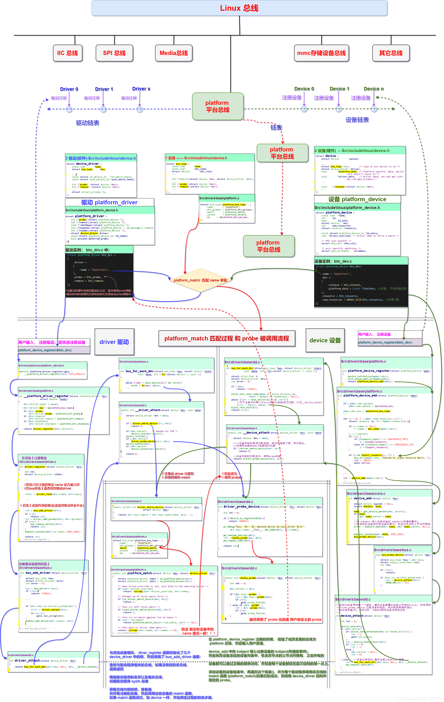
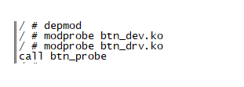
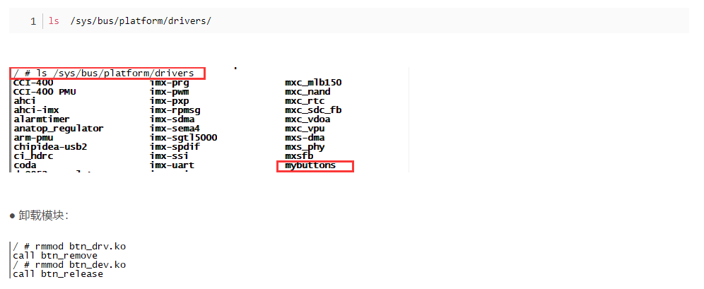

# 一张图掌握 Linux platform 平台设备驱动框架！

嵌入式系统中有很多的物理总线：I2c、SPI、USB、uart、PCIE、APB、AHB。

像这样的总线很多，而 Linux 系统要考虑到驱动的可重用性，因此提出了驱动的分离与分层这样的软件思路，于是 Linux从2.6起就加入了 platform 设备驱动，也叫做平台设备驱动。它是一条虚拟的总线, 并不是一个物理的总线。如下图所示：（本文不考虑设备树的情况）：



---

### 一、总线驱动模型简介

总线是处理器与一个或者多个设备之间的通道，在设备模型中，所有的设备都是通过总线相连，当然也包括虚拟的 platform 平台总线。

总线驱动模型中有三要素：
**1.总线**
● struct bus_type 结构体

  ```C
  struct bus_type {
  	const char		*name;
  	
  	const char		*dev_name;
  	struct device		*dev_root;
  	...
  };
  ```

  name 成员是总线的名字，比如 **platform:**


  ● 总线注册：

  ```
  bus_register      //注册一条总线
  bus_unregister    //注销总线
  ```

  平台总线的注册如下：

  

  **2.总线设备(硬件)**
  ● struct device 结构：

  在最底层，Linux 系统中每一个设备都用 device 结构的一个实例来表示：

```
 struct device //device.h
 {
    struct bus_type    *bus;//代表该设备挂在哪条总线上
    void    (*release)(struct device *dev); //release 是必须实现的
    ...
 }
```

**3.设备驱动(软件)**

设备模型跟踪所有系统所知道的设备，进行跟踪的主要原因是让驱动程序核心协调驱动程序与新设备之间的关系。

设备驱动程序可以导出信息和配置变量，这些是独立于任何特定设备的。

**● device_driver 结构：**

```c
struct device_driver //device.h
 {
 	//用于和硬件进行匹配
    const char  *name;
    
    struct bus_type        *bus;
    int (*probe) (struct device *dev);
    int (*remove) (struct device *dev);
    ...
 }
```

● 注册函数：

```c
driver_register(struct device_driver *drv)
driver_unregister(struct device_driver *drv)
```

### 二、platform 平台总线

为了达到所有硬件都可以按照总线设备驱动模型来实现驱动，内核中建立一条虚拟的总线platform，它可以将那些没有真正挂在具体总线上的硬件， 虚拟的认为挂在了platform总线上，达到统一。

而其中用户最需要做的就是填充 platform_driver 驱动 和 platform_device设备。

**1.platform_device**
 “继承” 于 device 的 platform 设备，用来描述硬件，存储硬件使用的资源信息和容易变化的信息

  ```c
  struct platform_device
   {
   	//设备的名字，用于和驱动进行匹配的
  	const char *name;
  	
  	//内核中维护的所有的设备必须包含该成员
      struct device    dev;
  
  	//资源个数
      u32 num_resources;
  	
  	//描述资源
      struct resource    * resource;
      ...
   }
  ```

  其中 **struct resource**

  ```c
  struct resource {
  	resource_size_t start;  	//表示资源的起始值，           
  	resource_size_t end;    	//表示资源的最后一个字节的地址， 如果是中断，end和satrt相同
  	const char *name;   		// 可不写  
  	unsigned long flags; 		//资源的类型
  	struct resource *parent, *sibling, *child;
  };
  
  // [flags] 类型，通常将该硬件使用的物理地址、中断号视为资源:
  #define IORESOURCE_MEM  0x00000200    //内存: 物理地址资源
  #define IORESOURCE_IRQ  0x00000400    //中断: 中断号资源
  ```

● 注册设备 platform_driver_register ：

  ```C
  // #define platform_driver_register(drv) \
  // __platform_driver_register(drv, THIS_MODULE)
  
  platform_device_register(struct platform_device *);
  ```

**2.platform_driver**


继承于 device_driver 的 platform_driver 设备驱动：

```C
struct platform_driver
 {
 	//当驱动和硬件信息匹配成功之后，就会调用probe函数，驱动所有的资源的注册和初始化全部放在probe函数中
	int (*probe)(struct platform_device *);  
	
	//硬件信息被移除了，或者驱动被卸载了，全部要释放，释放资源的操作就放在该函数中
	int (*remove)(struct platform_device *);
	
	void (*shutdown)(struct platform_device *);
 	int (*suspend)(struct platform_device *, pm_message_t state);
 	int (*resume)(struct platform_device *);

	//内核维护的所有的驱动必须包含该成员，通常driver->name用于和设备进行匹配
    struct device_driver driver;
    
    //往往一个驱动可能能同时支持多个硬件，这些硬件的名字都放在该结构体数组中
    const struct platform_device_id *id_table;
    
    bool prevent_deferred_probe;
 }
```

● 驱动注册和卸载

```C
platform_driver_register(struct platform_driver *);
platform_driver_unregister(struct platform_driver *);
```

### 三、实例

**1.设备 platform_device**
1）填充 struct platform_device 的各个成员，主要为：

赋值设备名；
填充 resource 结构变量；
填充 struct device dev;
2）向系统注册设备：platform_device_register

3）注销设备：platform_device_unregister

```C
//btn_dev.c
#include <linux/init.h>
#include <linux/module.h>
#include <linux/input.h>
#include <linux/platform_device.h>
#include <mach/platform.h>
#include "btn_desc.h"

MODULE_LICENSE("GPL");

//1) 填充 struct platform_device 的各个成员：初始化 resource 结构变量。
struct  resource btn_resource[]=
{
    {
        .start = IRQ_GPIO_A_START + 28,
        .end   = IRQ_GPIO_A_START + 28,  //可以不赋值
        .flags = IORESOURCE_IRQ,         //中断类型资源
    },
    {
        .start = IRQ_GPIO_B_START + 30,
        .end   = IRQ_GPIO_B_START + 30,  //可以不赋值
        .flags = IORESOURCE_IRQ,
    },
};

//1) 填充 struct platform_device 的各个成员：初始化 私有资源 结构变量。
btn_desc_t buttons[] =  //私有资源，描述信息
{
    {"up",   PAD_GPIO_A+28, KEY_UP},
    {"down", PAD_GPIO_B+30, KEY_DOWN},
};

//1) 填充 struct platform_device 的各个成员：  注销设备时，调用
void btn_release(struct device *dev)  
{
    printk("call %s\n", __func__);
}

//1) 填充 struct platform_device 的各个成员：
struct platform_device btn_dev =
{
    .name = "mybuttons",
    .dev =
    {
        .release = btn_release,
        .platform_data = (void *)buttons,  //私有，平台设备总线
    },
    .resource = btn_resource,
    .num_resources = ARRAY_SIZE(btn_resource), //资源个数
};

// 2）向系统注册设备：platform_device_register
int __init btn_dev_init(void)
{
    platform_device_register(&btn_dev);  //1.向dev中加入一个节点， 2.与driver设备匹配
    return 0;
}

//3）注销设备：platform_device_unregister
void __exit btn_dev_exit(void)
{
    platform_device_unregister(&btn_dev);
}
module_init(btn_dev_init);
module_exit(btn_dev_exit);
```

以上必须在设备驱动加载前完成，即执行platform_driver_register（）之前，原因是驱动注册时需要匹配内核中所有已注册的设备名。

结合上面框架流程图，在 platform_device_register 注册的时候， 赋值了成员变量的总线为 platform 总线，然后插入用户资源。device_add 中向 kobject 核心注册设备的 kobject(热插拔事件)，然后将改设备添加到设备列表中，包含改节点的父节点所拥有，之后所有的设备都可以通过正确的顺序访问，并知道每个设备都挂在层次结构的哪一点上。

添加设备到设备链表中、再遍历这个链表()，并为每个驱动程序调用该总线的 match 函数 (platform_match)

如果匹配成功，则调用 device_driver 结构中指定的 probe。

**2.驱动 platform_driver**
platform_driver 的填充

1）填充 struct platform_driver 的各个成员，主要为：

​	● 赋值驱动名；
​	● 填充 probe 成员；
​	● 填充 remove 成员
2）向系统注册驱动：platform_driver_register

3）注销驱动：platform_driver_unregister

```c
//btn_drv.c
#include <linux/init.h>
#include <linux/module.h>
#include <linux/platform_device.h>
#include "btn_desc.h"

MODULE_LICENSE("GPL");

//1）填充 struct platform_driver  的各个成员:  .probe = btn_probe
int btn_probe(struct platform_device *dev)
{
    printk("call %s\n", __func__);
    return 0;
}

//1）填充 struct platform_driver  的各个成员:  .remove = btn_remove
int btn_remove(struct platform_device *dev)
{
    printk("call %s\n", __func__);
    return 0;
}

//1）填充 struct platform_driver  的各个成员:  绑定
//继承于device_driver的 platform_driver 设备驱动
struct platform_driver btn_drv =
{
	//struct device_driver driver
    .driver =
    {
        .name = "mybuttons",
    },
     
	//int (*probe)(struct platform_device *)
    .probe = btn_probe,
    //int (*remove)(struct platform_device *)
    .remove = btn_remove,
};

//2）向系统注册驱动：platform_driver_register
int __init btn_drv_init(void)
{
    platform_driver_register(&btn_drv);  //1.向dev中加入一个节点， 2.与device设备匹配
    return 0;
}

//3）注销驱动：platform_driver_unregister
void __exit btn_drv_exit(void)
{
    platform_driver_unregister(&btn_drv);
}
module_init(btn_drv_init);
module_exit(btn_drv_exit);
```


结合上面框架流程图，在 platform_driver_register 注册的时候，一个 platform 驱动程序添加到 platform 核心中。

与添加设备相似， diver_register 函数初始化了几个 device_driver 中的锁，然后调用了 bus_add_driver 函数：

​	● 查找与驱动程序相关的总线。如果没有找到该总线，函数返回
​	● 根据驱动程序的名字以及相关总线，创建驱动程序 sysfs 目录
​	● 获取总线内部的锁，接着遍历所有注册的设备，然后调用这些设备的 match 函数。如果 match 函数成功，如 device 一样，开始绑定过程的剩余步骤。

### 四、测试

**1.驱动和设备的 Makefile**

   ```
   KERNELDIR := /home/chunn/linux/IMX6ULL/linux/temp/linux-imx-rel_imx_4.1.15_2.1.0_ga_alientek
   CURRENT_PATH := $(shell pwd)
   
   obj-m	+= btn_dev.o
   obj-m	+= btn_drv.o
   
   build: kernel_modules
   
   kernel_modules::
   	$(MAKE) -C $(KERNELDIR) M=$(CURRENT_PATH) modules
   clean:
   	$(MAKE) -C $(KERNELDIR) M=$(CURRENT_PATH) clean
   ```
### 2.运行


● **加载模块**：

   将编译出来 btn_dev.ko、btn_drv.ko 拷贝到 rootfs/lib/modules/4.1.15 目录中，然后输入如下

   

   结果一致：

   ```
   int btn_probe(struct platform *dev){
   	printk("call %s\n",__func__);
   	return 0;
   }
   ```

   ● **查看在系统中的驱动：**

   

   **【参考】**
   ● 公众号：一口Linux ，作者土豆居士

   ● 《Linux设备驱动程序(第3版)》

   ● 《【正点原子】I.MX6U嵌入式Linux驱动开发指南V1.5.1》

   ● Linux内核源码 4.1.15

----

 一张图掌握 Linux platform 平台设备驱动框架！【建议收藏】_火山上的企鹅的博客-CSDN博客_linux platform - https://blog.csdn.net/qq_16504163/article/details/118562670

