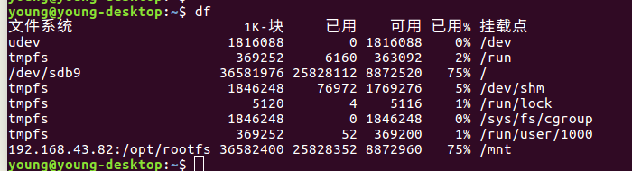

1.PC端安装nfs服务器软件：

```
sudo apt-get install nfs-kernel-server nfs-common portmap -d
```

2.配置服务器：

```
sudo vi /etc/exports
```

添加一行配置：

```
/opt/rootfs *(rw,sync,no_root_squash)
```

​	/opt/rootfs 是NFS的共享目录，

​	*:这里可以指定IP,  *代表所有客户端无论IP是多少都可以访问该目录

​	rw:客户端对该目录的操作权限

​	sync:读写同步

​	no_root_squash:权限相关

还有其它参数具体意义可参考：

nfs原理及安装配置 - 风住 - 博客园 - https://www.cnblogs.com/whych/p/9196537.html

3.重启服务器：

```
sudo /etc/init.d/nfs-kernel-server restart
```

4.挂载测试：

```
sudo mount -t nfs 192.168.43.82:/opt/rootfs /mnt
```

结果如图：



遇到的问题：

1.

```
young@young-desktop:~$ sudo /etc/init.d/nfs-kernel-server restart
[....] Restarting nfs-kernel-server (via systemctl): nfs-kernel-server.serviceJob for nfs-server.service failed because the control process exited with error code. See "systemctl status nfs-server.service" and "journalctl -xe" for details.
 failed!
```

因为配置文件出错

```
/opt/rootfs *(rw,sync.no_root_squash)
改成：
/opt/rootfs *(rw,sync,no_root_squash)
就OK了！
```

2.

```
young@young-desktop:~$ sudo mount -t nfs 192.168.43.82:/tmp /mnt
mount.nfs: access denied by server while mounting 192.168.43.82:/tmp
```

因为nfs共享的路径出错，配置文件没有这个路径，改成

```
young@young-desktop:~$ sudo mount -t nfs 192.168.43.82:/opt/rootfs /mnt
```

就可以了。