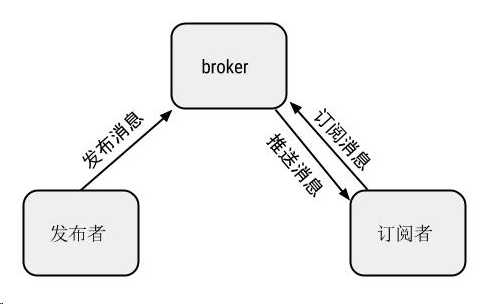
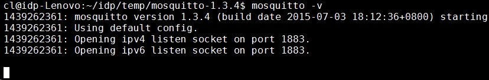

MQTT 协议和 mosquitto :: Shaocheng.Li — Hello Friends - https://shaocheng.li/posts/2015/08/11/

MQTT 协议和 mosquitto
1. MQTT 介绍
http://mqtt.org/

MQTT 是一个轻型协议，使用基于 TCP/IP 协议的发布/订阅消息转发模式，专门用于机器对机器 (M2M) 通信。 MQTT 协议的中心是 MQTT 服务器或代理 (broker) ，支持发布程序和订阅程序进行访问，如下图所示：

用户可以使用 MQTT 构建一个传感器网络，其中各种传感器都能够以其传感器独有的消息形式发布传感器值。 订阅程序能够订阅不同的消息，以据此采取措施。 MQTT 代理将处理从发布程序到订阅程序的转发消息。

如果已经有了一个 broker ，可以直接用 MQTT 客户端软件测试。这里有一个跨平台的 MQTT 客户端 <a href="https://mqttfx.jensd.de" target="_blank">MQTT.fx</a> 。

<h2 id="2-mosquitto">2. Mosquitto</h2>

mosquitto 是一个开源的 MQTT broker ，目前支持 v3.1 和 v3.1.1 协议 ，同时提供了一个 C 语言动态链接库 libmosquitto ，用于实现 mqtt 客户端：

<a href="http://mosquitto.org/documentation/" target="_blank">http://mosquitto.org/documentation/</a>

下载 mosquitto-1.4.2.tar.gz 后，解压，然后执行 make ，make install 。即可得到几个二进制可执行文件：

<ul>
<li>mosquitto : mqtt broker</li>
<li>mosquitto_passwd : 管理 mosquitto 密码文件的命令行工具</li>
<li>mosquitto_sub : mqtt 订阅者程序</li>
<li>mosquitto_pub ： mqtt 发布者程序</li>
</ul>

相关的配置文件安装在 /etc/mosquitto/ 目录下。在 Ubuntu 下可以直接安装 `sudo apt-get install mosquitto` 。

现在测试一下客户端和服务端程序。为了测试方便，将客户端和服务端程序都在本机，使用 localhost 连接。执行 `mosquitto -v` 启动 broker ，-v 参数表示打印出运行信息，可以看到默认使用的端口是1883 :

如果你的系统出现如下问题，就需要添加一个 mosquitto 用户：