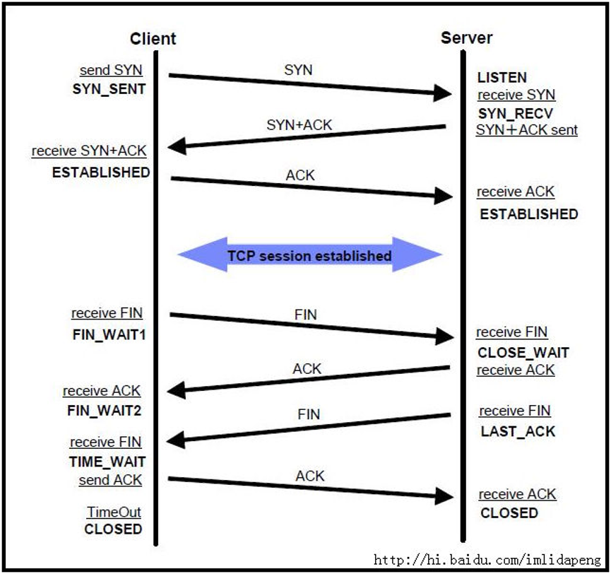
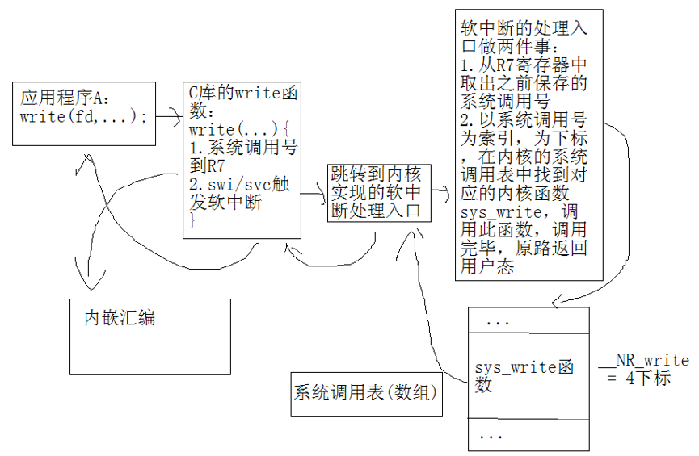

----

1.证明大小端问题？

大同小异

0x12345678

打印输出是相同的是大端，打印出0x12 0x34 0x56 0x78，所以大同

打印输出是差异的是小段，打印出0x78 0x56 0x34 0x12，所以小异

大端：高位低字节(低地址)

小端：高位高字节(高地址)

```C
#include <stdio.h>
union System
{
	char a;
	int b;
};
 
int main()
{
    union System s;
	s.b = 1;
	
	printf("0x%x\n",&s.a);
	printf("0x%x\n",&s.b);
	
	if(s.a == 1)
	{
		printf("Little-endian\n");
	}
	else
	{
		printf("Big-endian\n");
	}
	  
    return 0;
}
```

(1条消息)面试题：C语言验证大小端的几个方法_嵌入式资讯精选-CSDN博客 - https://blog.csdn.net/DP29syM41zyGndVF/article/details/103640847

---

2.struct 对齐补齐

---

3.死锁是怎么造成的？如何避免死锁？

什么是线程死锁?如何解决?（蚂蚁金服面试题） - 一说烟雨 - 博客园 - https://www.cnblogs.com/ysyy/p/10904081.html
多线程死锁的产生以及如何避免死锁 - sthu - 博客园 - https://www.cnblogs.com/sthu/p/9660914.html

什么是死锁？怎么防止死锁？ - https://mp.weixin.qq.com/s/yVM1KJ-vHabte72iXLsy1g什么是死锁？怎么防止死锁？

一、定义

死锁是指两个或两个以上的线程在执行过程中，由于竞争资源或者由于彼此通信而造成的一种阻塞的现象，若无外力作用，它们都将无法推进下去。此时称系统处于死锁状态或系统产生了死锁，这些永远在互相等待的进程称为死锁进程。

二、产生条件：

1）互斥条件：指进程对所分配到的资源进行排它性使用，即在一段时间内某资源只由一个进程占用。如果此时还有其它进程请求资源，则请求者只能等待，直至占有资源的进程用毕释放。

2）请求和保持条件：指进程已经保持至少一个资源，但又提出了新的资源请求，而该资源已被其它进程占有，此时请求进程阻塞，但又对自己已获得的其它资源保持不放。

3）不剥夺条件：指进程已获得的资源，在未使用完之前，不能被剥夺，只能在使用完时由自己释放。

4）环路等待条件：指在发生死锁时，必然存在一个进程——资源的环形链，即进程集合{P0，P1，P2，···，Pn}中的P0正在等待一个P1占用的资源；P1正在等待P2占用的资源，……，Pn正在等待已被P0占用的资源。

三、产生原因：

1、竞争资源引起进程死锁

2、可剥夺资源和不可剥夺资源

3、竞争不可剥夺资源

4、竞争临时资源

四、如何避免（预防）和解决死锁：

A.预防

a.打破互斥条件：改造独占性资源为虚拟资源，大部分资源已无法改造。

b.打破不可抢占条件：当一进程占有一独占性资源后又申请一独占性资源而无法满足，则退出原占有的资源。

c.打破占有且申请条件：采用资源预先分配策略，即进程运行前申请全部资源，满足则运行，不然就等待，这样就不会占有且申请。

d.打破循环等待条件：实现资源有序分配策略，对所有设备实现分类编号，所有进程只能采用按序号递增的形式申请资源。

如：有序资源分配法、银行家算法

B.解决方法

a.进行系统的重新启动

b.撤消进程，剥夺资源。终止参与死锁的进程，收回它们占有的资源，从而解除死锁。

c.进程回退策略，即让参与死锁的进程回退到没有发生死锁前某一点处，并由此点处继续执行，以求再次执行时不再发生死锁。

---------------------

IPC：inter-processer communication 进程间通信有？

进程间通信 （IPC） 方法总结 (一) - 12oz - 博客园 - https://www.cnblogs.com/joker-wz/p/11000489.html

进程间通信 （IPC） 方法总结（二） - 12oz - 博客园 - https://www.cnblogs.com/joker-wz/p/11006414.html

进程间通信 （IPC） 方法总结（三） - 12oz - 博客园 - https://www.cnblogs.com/joker-wz/p/11013086.html

消息队列，管道/匿名管道，socket，信号，信号量集，共享内存

---

**TCP** **协议通过几次握手来保证通信双方确认的正确，讲一下具体过程？**

答：在客户机和服务器之间建立TCP网络连接时，客户机首先发出SYN消息，服务器使用SYN-ACK应答表示接收到了这个消息，最后客户机再以ACK消息响应。这样在客户机和服务器之间才能建立起可靠的TCP连接，数据才可以在客户机和服务器之间传递。

 

TCP协议的三次握手

​    TCP提供的可靠数据传输服务，是依靠接收端TCP软件按序号对收到的数据分组进行逐一确认实现的。这个过程在TCP收发端开始通信时，被称为三次握手初始化。

 第一次握手：建立连接时，客户端发送syn包(syn=j)到服务器，并进入SYN_SEND状态，等待服务器确认；
    第二次握手：服务器收到syn包，必须确认客户的SYN（ack=j+1），同时自己也发送一个SYN包（syn=k），即SYN+ACK包，此时服务器进入SYN_RECV状态； 
    第三次握手：客户端收到服务器的SYN＋ACK包，向服务器发送确认包ACK(ack=k+1)，此包发送完毕，客户端和服务器进入ESTABLISHED状态，完成三次握手。

TCP的三次握手(建立连接）和四次挥手(关闭连接） - higirle - 博客园

http://www.cnblogs.com/Jessy/p/3535612.html

由于TCP连接是全双工的，因此每个方向都必须单独进行关闭。这个原则是当一方完成它的数据发送任务后就能发送一个FIN来终止这个方向的连接。收到一个 FIN只意味着这一方向上没有数据流动，一个TCP连接在收到一个FIN后仍能发送数据。首先进行关闭的一方将执行主动关闭，而另一方执行被动关闭。

 CP的连接的拆除需要发送四个包，因此称为四次挥手(four-way handshake)。客户端或服务器均可主动发起挥手动作，在socket编程中，任何一方执行close()操作即可产生挥手操作。

（1）客户端A发送一个FIN，用来关闭客户A到服务器B的数据传送。 

（2）服务器B收到这个FIN，它发回一个ACK，确认序号为收到的序号加1。和SYN一样，一个FIN将占用一个序号。 

（3）服务器B关闭与客户端A的连接，发送一个FIN给客户端A。 

（4）客户端A发回ACK报文确认，并将确认序号设置为收到序号加1



---

**TCP协议和UDP协议的比较**

TCP:

1、面向连接的，类似打电话，在通信的整个过程保持连接；

2、传输可靠的，可以自动重发一切错误数据，保证数据的正确性和完整性；

3、基于字节流的数据传输，可用于传输大量数据，数据接收方可以通知发送方进行数据流量的控制；4、速度慢，建立连接需要开销较多的系统资源

 

UDP：

1、面向非连接的，类似发短信，正式通信前不必与对方建立连接，不管对方状态就直接发送；

2、不提供可靠性、流控、差错恢复功能

3、使用数据包传输模式，用于传输少量数据

4、速度快，系统资源占有率较低

---

关于socket网络编程

**基于TCP协议的编程模型**

服务器：

  (1)创建socket,使用socket函数

  (2)准备通信地址，使用结构体类型：struct sockaddr_in与struct in_addr

htons（）函数与inet_addr()函数

  (3)绑定socket和通信地址,使用bind函数

  (4)监听，使用listen函数

(5)响应客户端的连接请求，使用accept函数

  (6)进行通信，使用send/recv函数

(7)关闭socket,使用close函数

客户端： 

  (1)创建socket,使用socket函数

  (2)准备通信地址,是服务器的地址

  (3)连接socket和通信地址,使用connect函数

  (4)进行通信,使用send/recv函数

  (5)关闭socket,使用close函数

 

**基于UDP协议的通信模型**

服务器：

(1)创建socket,使用socket函数 

  (2)准备通信地址，使用结构体类型

  (3)绑定socket和通信地址，使用bind函数

  (4)进行通信，使用sendto/send/recvfrom/recv函数

  (5)关闭socket,使用close函数

客户端：

  (1)创建socket，使用socket函数

  (2)准备通信地址，使用服务器的地址

  (3)进行通信,使用sendto/send/recvfrom/recv函数

  (4)关闭socket,使用close函数

---

.系统调用的基本概念
系统调用就是操作系统内核对外提供的一系列接口函数，当外部函数调用系统调用函数时，会通过软中断的方式把地址空间从用户空间切换到内核空间，执行系统调用函数的功能，功能执行完毕之后，地址空间有内核空间切回到用户空间.

谈谈系统调用的实现过程

答：以write系统调用函数为例：

  1.应用程序调用write系统调用函数，首先调用到C库的write 函数

  2.C库的write函数将会做两件事：

   2.1.保存write函数的系统调用号到R7寄存器

   系统调用号：linux内核给每一个系统调用函数指定一个软件编号(身份证号)，write的系统调用号__NR_write=4

//SVC：（Supervisor）操作系统保护模式，处理软件中断（SWI)

   2.2.调用svc指令触发软中断异常，至此CPU的工作模式由    USR切换到SVC

  3.一旦触发软中断异常，CPU毫无条件的跳转异常向量表的软中断处理入口(内核来实现)，至此应用程序由用户态切换   到内核态继续运行

  4.跳转到软中断的处理入口，将会做两件事：

   1.从R7取出系统调用号

   2.以系统调用号为索引在系统调用表中找到对应的内核函数sys_write

   3.调用内核函数sys_write,调用完毕，原路返回到用户态



---

QVGA和VGA都是指的屏幕分辨率，也就是指屏幕在横向和纵向上，能够显示的点的数量。

VGA的标准是640*480，即横向有640个点，纵向有480个点。

QVGA是VGA的四分之一，即横向和纵向各小一半，即分辨率为320*240。

VGA:640*480

QVGA:320*240 也就是1/4的VGA，Q = Quarter

WQVGA: 400*240

CIF:352*288
QCIF：176*144

请列举H.264裸流的帧类型并简要说明？

在NAL Header 这个字节的低5位，数值1~12

简单地说，I帧 就是关键帧，属于帧内压缩。P 是向前搜索的意思。B 是双向搜索。它们都是基于 I帧 来压缩数据。

I帧：表示关键帧，可以理解为 这一帧画面的完整保留，解码时只需要本帧数据就可以完成（因为包含完整画面）。

B帧：是双向差别的帧，也就是 B帧 记录的是本帧与前后帧的差别。要解码 B帧，不仅要取得之前的缓存画面，还要本帧之后的画面，通过前后画面与本帧数据的叠加取得最终的画面。B帧 压缩率高，但是解码时 CPU 会比较累。

P帧：表示的是这一帧跟之前的一个关键帧（或 P帧）的差别，解码时需要用之前缓存的画面叠加上本帧定义的差别，生成最终画面。也就是差别帧，P帧 没有完整画面数据，只有与前一帧的画面差别的数据

1. I帧即Intra-coded picture（帧内编码图像帧），不参考其他图像帧，只利用本帧的信息进行编码。
2. P帧即Predictive-coded Picture（预测编码图像帧），利用之前的I帧或P帧，采用运动预测的方式进行帧间预测编码。
3. B帧即Bidirectionally predicted picture（双向预测编码图像帧)，提供最高的压缩比，它既需要之前的图像帧(I帧或P帧)，也需要后来的图像帧(P帧)，采用运动预测的方式进行帧间双向预测编码。


。。。

请计算QVGA图片的原始数据大小（YUV4:2:0格式）？

320\*240\*2/3 = 115200 byte