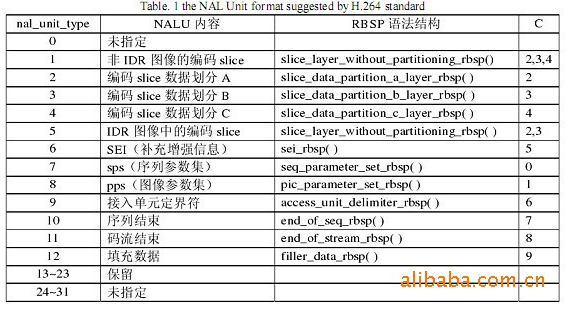

## H264学习

H264之基础篇 - 季末的天堂 - 博客园 - https://www.cnblogs.com/jimodetiantang/p/9110647.html

# [H264之基础篇](https://www.cnblogs.com/jimodetiantang/p/9110647.html)

# 1. H264 基础概念

在 H.264/AVC 视频编码标准中，整个系统框架划分为如下两个层面：

- 视频编码层（VCL）：VCL 数据即被压缩编码后的视频数据序列，负责有效表示视频数据的内容；
- 网络抽象层（NAL）：负责将 VCL 数据封装到 NAL 单元中，并提供头信息，以保证数据适合各种信道和存储介质上的传输。

因此平时每帧数据就是一个 NAL 单元。NAL 单元的实际格式如下：

```
.
     +-+-+-+-+-+-+-+-+-+-+-+-+-+-+-+-+-+-+-+-+-+-+-+-+-+-+-+-+-+-+-+-+
     |  NAL Header   |      EBSP     |  NAL Header   |      EBSP     | ...
     +-+-+-+-+-+-+-+-+-+-+-+-+-+-+-+-+-+-+-+-+-+-+-+-+-+-+-+-+-+-+-+-+
```

每个 NAL 单元都是由 1 字节 NAL header 和 若干整数字节的负荷数据 EBSP 构成。

## 1.1 起始码

在网络传输 H.264 数据时，一个 UDP 包就是一个 NALU，解码器可以很方便的检测出 NAL 分界和解码。但是如果编码数据存储为一个文件，原来的解码器将无法从数据流中分辨出每个 NAL 的起始位置和终止位置，因此 H.264 用起始码来解决这个问题。

H.264 编码中，在每个 NAL 前添加起始码 0x00000001（4bytes） 或 0x000001（3bytes），解码器在码流中检测到起始码，表明前一个 NAL 的结束并开始新的一个 NAL 单元。为了防止 NAL 内部出现 0x00000001 的数据，H.264 又提出 "防止竞争 emulation prevention" 机制，在编码完一个 NAL 时，如果检测出有连续的两个 0x00 字节，就在后面插入一个 0x03。当解码器再 NAL 内部检测到 0x000003 的数据时，就把 0x03 抛弃，恢复原始数据。

- 0x000000 >>>>>> 0x00000300
- 0x000001 >>>>>> 0x00000301
- 0x000002 >>>>>> 0x00000302
- 0x000003 >>>>>> 0x00000303

## 1.2 NAL Header

NAL Header 的格式如下所示：

```
.    
      0 1 2 3 4 5 6 7 
     +-+-+-+-+-+-+-+-+
     |F|NRI|  TYPE   |  
     +-+-+-+-+-+-+-+-+
```

- F（1 bit）：Forbidden_zero_bit，禁止位，编码中默认为 0，当网络识别此单元中存在比特错误时，可将其设为 1，以便接收方丢掉该单元。主要用于适应不同种类的网络环境（比如有线无线相结合的环境）。例如对于从无线到有线的网关，一边是无线的非 IP 环境，一边是有线网络的无比特错误的环境。假设一个 NAL 单元达到无线那边时，校验和检测失败，网关可以选择从 NAL 流中去掉这个 NAL 单元，也可以把已知被破坏的 NAL 单元传给接收端。在这种情况下，智能的解码器将尝试重构这个 NAL 单元（已知它可能包含比特错误）。而非智能的解码器将简单的抛弃这个 NAL 单元。
- NRI（2 bits）：Nal_ref_idc，重要性指示位，用于在重构过程中标记一个 NAL 单元的重要性，值越大，越重要。值为 0 表示这个 NAL 单元没有用于预测，因此可被解码器抛弃而不会有错误扩散；值高于 0 表示此 NAL 单元要用于无漂移重构，且值越高，对此 NAL 单元丢失的影响越大。例如，若当前 NAL 属于参考帧的片，或是序列参数集，或是图像参数集这些重要的单位时，该值必须大于 0.
- TYPE（5 bits）：表示当前 NAL 单元的类型，类型 1~12 是 H.264 定义的，类型 24~31 是用于 H.264 以外的，RTMP 符合规范使用这其中的一些值来定义包聚合和分裂，其他值为 H.264 保留。

TYPE 的取值如下表所示：



## 1.3 EBSP

- SODB：数据比特串，最原始的编码数据
- RBSP：原始字节序列载荷，在 SODB 的后面填加了结尾比特（RBSP trailing bits，一个 bit "1"）若干比特 "0"，以便字节对齐。
- EBSP：扩展字节序列载荷，在 RBSP 基础上填加了仿校验字节（0x03），它的原因是：在 NALU 加到 Annexb 上时，需要添加每组 NALU 之前的开始码 StartCodePrefix，如果该 NALU 对应的 slice 为一帧的开始（即为 IDR 帧）则用 4 位字节表示：0x00000001，否则用 3 位字节表示：0x000001。**为了使 NALU 主体中不包括与开始码相冲突的，在编码时，每遇到两个字节连续为 0，就插入一个字节的 0x03。解码时将 0x03 去掉。也称为 "脱壳操作"。**

H.264 的具体封装过程如下：

1. 第一步：将 VCL 层输出的 SODB 封装成 nal_unit，nal_unit 是一个通用的封装格式，可以适用于有序字节流方式和 IP 包交换方式。
2. 第二步：针对不同的传送网络（电路交换/包交换），将 nal_unit 封装成针对不同网络的封装格式。

#### 第一步具体过程

VCL 层输出的比特流 SODB（String Of Data Bits）到 nal_unit 之间，经过以下三步处理：

1. SODB 字节对齐处理后封装成 RBSP（Raw Byte Sequence Payload）。

2. 为防止 RBSP 的字节流与有序字节流传送方式下的 SCP （start_code_prefix_one_3bytes，0x000001）出现字节竞争情形，循环检测 RBSP 前三个字节，在出现字节竞争时在第三个字节前加入 **emulation_prevention_three_byte(0x03)**，具体如下：

   ```C
   nal_unit(NumBytesInNALunit)
   {
       forbidden_zero_bit;
       nal_ref_idc;
       nal_unit_type;
       NumBytesInRBSP = 0;
       for (i = 1; i < NumBytesInNALunit; i++)
       {
           if (i + 2 < NumBytesInNALunit && next_bits(24) == 0x000003)
           {
               rbsp_byte[ NumBytesInRBSP++ ];
               rbsp_byte[ NumBytesInRBSP++ ];
               i += 2;
               emulation_prevention_three_byte;  /* equal to 0x03 */
           }
           else 
           {
               rbsp_byte[ NumBytesInRBSP++ ]
           }
       }
   }
   ```

   1. 防止字节竞争处理后的 RBSP（即此时为 EBSP 了）再加上一个字节的 NAL Header（forbidden_zero_bit + nal_ref_idc + nal_unit_type），封装成 nal_unit。

   #### 第二步的具体过程

   ##### case 1：有序字节流的封装

   ```C
   byte_stream_nal_unit( NumBytesInNALunit ) 
   { 
       while( next_bits( 24 ) != 0x000001 ) 
           zero_byte /* equal to 0x00 */ 
   
       if( more_data_in_byte_stream( ) ) 
       { 
           start_code_prefix_one_3bytes /* equal to 0x000001 */ nal_unit( NumBytesInNALunit )
       } 
   } 
   ```

   类似H.320和MPEG-2/H.222.0等传输系统，传输NAL作为有序连续字节或比特流，同时要依靠数据本身识别NAL单元边界。在这样的应用系统中，H.264/AVC规范定义了字节流格式，每个NAL单元前面增加3个字节的前缀，即同步字节。在比特流应用中，每个图像需要增加一个附加字节作为边界定位。还有一种可选特性，在字节流中增加附加数据，用做扩充发送数据量，能实现快速边界定位，恢复同步.

   ##### case 2: IP 网络的 RTP 打包封装

   分组打包的规则：

   1. 额外的开销要小，使 MTU 尺寸在 100~64K 字节范围都可以；
   2. 不用对分组内的数据解码就可以判别分组的重要性；
   3. 载荷规范应当保证不用解码就可识别由于其他的比特丢失而造成的分组不可解码；
   4. 支持将 NALU 分割成多个 RTP 分组；
   5. 支持将多个 NALU 汇集在一个 RTP 分组中。

   RTP 的头标可以是 NALU 的头标，并可以实现以上的打包规则。

   一个 RTP 分组里放入一个 NALU，将 NALU（包括同时作为载荷头标的 NALU 头）放入 RTP 载荷中，设置 RTP 头标值。为了避免 IP 层对大分组的再一次分割，片分组的大小一般都要小于 MTU 尺寸。由于包传送的路径不同，解码端要重新对片分组排序，RTP 包含的次序信息可以用来解决这一问题。

   #### NALU 分割

   对于预先已经编码的内容，NALU 可能大于 MTU 尺寸的限制。虽然 IP 层的分割可以使数据块小于 64k 字节，但无法在应用层实现保护，从而降低了非等重保护方案的效果。由于 UDP 数据包小于 64k 字节，而且一个片的长度对某些应用场合来说太小，所以应用层打包是 RTP 打包方案的一部分。

   新的讨论方案(IETF)应当符合以下特征：

   1. NALU 的分块以按 RTP 次序号升序传输；
   2. 能够标记第一个和最后一个 NALU 分块；
   3. 可以检测丢失的分块

   #### NALU 合并

   一些 NALU 如 SEI 、参数集等非常小，将他们合并在一起有利于减少头标开销。已有两种集合分组：

   1. 单一时间集合分组（STAP），按时间戳进行组合
   2. 多时间集合分组（MTAP），不同时间戳也可以组合

   NAL 规范视频数据的格式，主要是提供头部信息，以适合各种媒体的传输和存储。NAL支持各种网络，包括：

   1. 任何使用 RTP/IP 协议的实时有线和无线 Internet 服务
   2. 作为 MP4 文件存储和多媒体信息文件服务
   3. MPEG-2 系统
   4. 其他网

   NAL 规定一种通用的格式，既适合面向包传输，也适合流传送。实际上，包传输和流传输的方式是相同的，不同之处是传输前面增加了一个起始码前缀在类似 Internet/RTP 面向包传送协议系统中，包结构中包含包边界识别字节，在这种情况下，不需要同步字节。

   NAL 单元分为 VCL 和 非VCL 两种:

   - VCL NAL 单元包含视频图像采样信息
   - 非 VCL 包含各种有关的附加信息，例如参数集（头部信息，应用到大量的 VCL NAL 单元）、提供性能的附加信息、定时信息等

   #### 参数集

   参数集是很少变化的信息，用于大量 VCL NAL 单元的解码，分为两种类型：

   1. 序列参数集（SPS: 7），作用于一串连续的视频图像，即视频序列。两个 IDR 图像之间为序列参数。
   2. 图像参数集（PPS: 8），作用于视频序列中的一个或多个个别的图像。

   序列和图像参数集机制，减少了重复参数的传送，每个 VCL NAL 单元包含一个标识，指向有关的图像参数集，每个图像参数集包含一个标识，指向有关的序列参数集的内容。因此，只用少数的指针信息，应用大量的参数，大大减少每个 VCL NAL 单元重复传送的信息。

   序列和图像参数集可以在发送 VCL NAL 单元以前发送，并且重复传送，大大提高纠错能力。序列和图像参数集可以在"带内"，也可以用更为可靠的其他"带外" 通道传送。

   # 2. I帧、B帧和 P帧

   视频压缩中，每一帧代表一副静止的图像。而在实际压缩时，会采取各种算法减少数据的容量，其中 IPB 就是最常见的。
   简单地说，I帧 就是关键帧，属于帧内压缩。P 是向前搜索的意思。B 是双向搜索。它们都是基于 I帧 来压缩数据。

   - I帧：表示关键帧，可以理解为 这一帧画面的完整保留，解码时只需要本帧数据就可以完成（因为包含完整画面）。
   - P帧：表示的是这一帧跟之前的一个关键帧（或 P帧）的差别，解码时需要用之前缓存的画面叠加上本帧定义的差别，生成最终画面。（也就是差别帧，P帧 没有完整画面数据，只有与前一帧的画面差别的数据）。
   - B帧：是双向差别的帧，也就是 B帧 记录的是本帧与前后帧的差别（具体比较复杂，有四种情况）。换言之，要解码 B帧，不仅要取得之前的缓存画面，还要本帧之后的画面，通过前后画面与本帧数据的叠加取得最终的画面。B帧 压缩率高，但是解码时 CPU 会比较累。

   采用的压缩方法：分组，将几帧图像分为一组（GOP），为防止运动变化，帧数不宜取多。

   1. 定义帧：将每组内各帧图像定义为三种类型，即 I帧，P帧，B帧；
   2. 预测帧：以 I帧 为基础帧，以 I帧 预测 P帧，再由 I帧 和 P帧 预测 B帧；
   3. 数据传输：最后将 I帧 数据与预测的差值信息进行存储和传输。

   ## 2.1 I帧

   I 图像（帧）是靠尽可能去除图像空间冗余信息来压缩传输数据量的帧内编码图像。

   I帧 又称为内部画面（intra picture），I帧 通常是每个 GOP（MPEG 所使用的一种视频压缩技术）的第一个帧，经过适度地压缩（作为随机访问的参考点）可以当成是图像。在 MPEG 编码的过程中部分视频帧序列压缩成为 I帧，部分压缩成 P帧，还有部分压缩成 B帧。I帧 法是帧内压缩法（P、B 为帧间），也称为"关键帧"压缩法。I帧 法是基于离散余弦变换 DCT（Discrete Cosine Transform）的压缩技术，这种算法与 JPEG 压缩算法类似。采用I帧压缩可达到 1/6 的压缩比而无明显的压缩痕迹。

   ### 2.1.1 I帧特点

   - 它是一个全帧压缩编码帧。它将全帧图像信息进行 JPEG 压缩编码及传输；
   - 解码时仅用 I帧 的数据就可以重构完整图像；
   - I帧 描述了图像背景和运动主体的详情；
   - I帧 是 P帧 和 B帧 的参考帧（其质量直接影响到同组中以后各帧的质量）；
   - I帧 是帧组 GOP 的基础帧（第一帧），在一组中只有一个 I帧；
   - I帧 不需要考虑运动矢量；
   - I帧 所占数据的信息量比较大。

   ## 2.2 P帧

   P图像（帧）是通过充分降低图像序列中前面已编码帧的时间冗余信息来压缩传输数据量的编码图像，也叫预测帧。

   在针对连续动态图像编码时，将连续若干幅图像分成 P，B，I 三种类型，P帧 由在它前面的 P帧 或 I帧 预测而来，它比较与它前面的 P帧 或 I帧 之间的相同信息或数据，也即考虑运动的特性进行帧间压缩。P帧 法是根据本帧与相邻的前一帧（I帧 或 P帧）的不同点来压缩本帧数据。采取 P帧 和 I帧 联合压缩的方法可达到更高的压缩且无明显的压缩痕迹。

   ##### P帧的预测和重构：

   P 帧是以 I 帧为参考帧，在 I 帧中找出 P 帧"某点"的预测值和运动矢量，取预测差值和运动矢量一起传送。在接收端根据运动矢量从 I 帧中找出 P 帧"某点"的预测值并与差值相加以得到 P 帧"某点"样值，从而得到完整的 P 帧。

   ### 2.2.1 P 帧特点

   - P 帧是 I 帧后面相隔 1~2 帧的编码帧；
   - P 帧采用运动补偿的方法传送与它前面的 I 帧或 P 帧的差值及运动矢量（预测误差）；
   - 解码时必须将 I 帧中的预测值与预测误差求和后才能重构完整的 P 帧图像；
   - P 帧属于前向预测的帧间编码。它只参考前面最靠近它的 I 帧或 P 帧；
   - P 帧可以是其后面 P 帧的参考帧，也可以是前后 B 帧的参考帧；
   - 由于 P 帧是参考帧，它可能造成解码错误的扩散；
   - 由于是差值传送，P 帧的压缩比较高。

   ## 2.3 B 帧

   B 图像（帧）是既考虑与源图像序列前面已编码帧，也顾及源图像序列后面已编码帧之间的时间冗余信息来压缩传输数据量的编码图像，也叫双向预测帧。

   B 帧法是双向预测的帧间压缩法。当把一帧图像压缩成 B 帧时，它根据相邻的前一帧、本帧以及后一帧数据的不同点来压缩本帧，也即仅记录本帧与前后帧的差值。只有采用 B 帧压缩才能达到 200：1 的高压缩。一般地，I 帧压缩效率最低，P 帧较高，B 帧最高。

   ##### B 帧的预测和重构：

   B 帧以前面的 I 帧或 P 帧以及后面的 P 帧为参考帧，"找出" B 帧 "某点" 的预测值和两个运动矢量，并取预测值和运动矢量传送。接收端根据运动矢量在两个参考帧中 "找出（算出）" 预测值并与差值求和，得到 B 帧 "某点" 样值，从而得到完整的 B 帧。

   ### 2.3.1 B 帧特点

   - B 帧是由前面的 I 帧或 P 帧和后面的 P 帧来进行预测的；
   - B 帧传送的是它与前面的 I 帧或 P 帧和后面的 P 帧之间的预测误差及运动矢量；
   - B 帧是双向预测编码帧；
   - B 帧压缩比最高，因为它只反映两参考帧间运动主体的变化情况，预测比较准确；
   - B 帧不是参考帧，不会造成解码错误的扩散。

   # 3. DTS 和 PTS

   - dts：Decode Time Stamp。dts 主要是标识读入内存中的 bit 流在什么时候送入解码器中进行解码。（解码时间戳）
   - pts：Presentation Time Stamp。pts 主要用于度量解码后的视频帧什么时候被显示出来。

   在没有 B 帧的情况下 dts 的顺序和 pts 的顺序是一样的。（显示时间戳）

   #### dts 和 pts 的不同：

   dts 主要用于视频的解码，在解码阶段使用。pts 主要用于视频的同步和输出，在 display 的时候使用。在没有 B frame 的情况下，dts 和 pts 的输出顺序是一样的。

   #### 例子：

   下面给出一个 GOP 为 15 的例子,其解码的参照 frame 及其解码的顺序都在里面:

   

如上图，I 帧的解码不依赖于任何的其它的帧，而 P 帧的解码则依赖于前面的 I 帧或者 P 帧。B 帧的解码则依赖于其前的最近的一个 I 帧或者 P 帧及其后的最近的一个 P 帧。

# 4. 语法层次结构分析

TaigaComplex 写的 [h.264语法结构分析](http://www.cnblogs.com/TaigaCon/p/5215448.html)。


---

---

其他文章学习：

H264(NAL简介与I帧判断) - JG2014 - 博客园 - https://www.cnblogs.com/yjg2014/p/6144977.html

FU-A方式分包 - Samaritan - 博客园 - https://www.cnblogs.com/samaritan/p/5063046.html

----

20200314：

H264码流的I/P/B帧NALU判断_Python_风清扬的博客-CSDN博客 - https://blog.csdn.net/DittyChen/article/details/55509718?depth_1-utm_source=distribute.pc_relevant.none-task&utm_source=distribute.pc_relevant.none-task

H264的I/P/B帧类型判断(一)_移动开发_朱韦刚(zhuweigangzwg)的技术博客-CSDN博客 - https://blog.csdn.net/zhuweigangzwg/article/details/44152239

H264编码原理以及I帧、B和P帧详解 - 星语海蓝 - 博客园 - https://www.cnblogs.com/cy568searchx/p/6125031.html

LivePush视频直播推送中对H264帧类型判断_网络_Kim的博客-CSDN博客 - https://blog.csdn.net/jinlong0603/article/details/70170042

视频编解码 GOP基本概念_移动开发_daiqiao_ios的博客-CSDN博客 - https://blog.csdn.net/daiqiao_ios/article/details/80751322

(2条消息)H264编码之GOP含义_网络_追求技术的丸子-CSDN博客 - https://blog.csdn.net/xiaoyida11/article/details/52852398

GOP group of pictures(图像组)
GOP 指的就是两个I帧之间的间隔. 比较说GOP为120,如果是720 p60 的话,那就是2s一次I帧.
在视频编码序列中，主要有三种编码帧：I帧、P帧、B帧，如下图所示。
1. I帧即Intra-coded picture（帧内编码图像帧），不参考其他图像帧，只利用本帧的信息进行编码
2. P帧即Predictive-codedPicture（预测编码图像帧），利用之前的I帧或P帧，采用运动预测的方式进行帧间预测编码
3. B帧即Bidirectionallypredicted picture（双向预测编码图像帧)，提供最高的压缩比，它既需要之前的图像帧(I帧或P帧)，也需要后来的图像帧(P帧)，采用运动预测的方式进行帧间双向预测编码
　　在视频编码序列中，GOP即Group of picture（图像组），指两个I帧之间的距离，Reference（参考周期）指两个P帧之间的距离。一个I帧所占用的字节数大于一个P帧，一个P帧所占用的字节数大于一个B帧。

　　所以在码率不变的前提下，GOP值越大，P、B帧的数量会越多，平均每个I、P、B帧所占用的字节数就越多，也就更容易获取较好的图像质量；Reference越大，B帧的数量越多，同理也更容易获得较好的图像质量。


---

H264中I帧和IDR帧的区别_fang437385323的专栏-CSDN博客 - https://blog.csdn.net/fang437385323/article/details/80470985

IDR（Instantaneous Decoding Refresh）--即时解码刷新

IDR 图像（立即刷新图像）

---

SPS、PPS、IDR介绍_网络_独行Freedom的博客-CSDN博客 - https://blog.csdn.net/qq_17368865/article/details/79206052

H.264码流第一个 NALU 是 SPS（序列参数集Sequence Parameter Set）

H.264码流第二个 NALU 是 PPS（图像参数集Picture Parameter Set）

H.264码流第三个 NALU 是 IDR（即时解码器刷新 Instantaneous Decoding Refresh）


(2条消息)sps和pps一篇好的解释_移动开发_luzubodfgs的专栏-CSDN博客 - https://blog.csdn.net/luzubodfgs/article/details/86775940

SPS即Sequence Paramater Set，又称作序列参数集。SPS中保存了一组编码视频序列(Coded video sequence)的全局参数。所谓的编码视频序列即原始视频的一帧一帧的像素数据经过编码之后的结构组成的序列 

---

H264详解之打包形式_GoldRoad88的博客-CSDN博客 - https://blog.csdn.net/goldroad88/article/details/77804138

SODB (String Of Data Bits), RBSP (Raw Byte Sequence Payload)的概念见H264标准。关于EBSP (Encapsulated Byte Sequence Payload)

emulation prevention byte

NAL 内部为防止与起始码竞争插入 0x03 

于是 H.264 提出了另外一种机制，叫做“防止竞争” 

NAL 内部为防止与起始码竞争而引入的填充字节 ,值为 0x03

---

图像基础知识之YUV - sheldon_blogs - 博客园 - https://www.cnblogs.com/blogs-of-lxl/p/10839053.html

YUV以及RGB所占内存大小_C#_建建的博客-CSDN博客 - https://blog.csdn.net/u013898698/article/details/54923882

---

WSDL（网络服务描述语言，Web Services Description Language）是一门基于 XML 的语言，用于描述 Web Services 以及如何对它们进行访问。

SOAP 是一种简单的基于 XML 的协议，它使应用程序通过 HTTP 来交换信息。SOAP (Simple Object Access Protocol)指简易对象访问协议

ONVIF协议学习笔记 - 努力改个网名 - 博客园 - https://www.cnblogs.com/lsdb/p/9157302.html

ONVIF = 服务端 + 客户端 =（Web Services + RTSP）+ 客户端 = （（WSDL + SOAP） + RTSP） + 客户端

WSDL是服务端用来向客户端描述自己实现哪些请求、发送请求时需要带上哪些参数xml组织格式；SOAP是客户端向服务端发送请求时的参数的xml组织格式

Web Services实现摄像头控制（比如一些参数配置、摄象头的上下左右（PTZ）控制）；RTSP实现报像头视频传输

Web Services具摄像头控制具体到技术交互实现上，其实和http差不多，客户端以类似http post的格式向服务端发送请求，然后服务端响应客户端请求。

---

ONVIF协议解读_网络_hktkfly6的专栏-CSDN博客 - https://blog.csdn.net/hktkfly6/article/details/78322154

自行实现 Onvif 对接开发模式_移动开发_技术联盟-CSDN博客 - https://blog.csdn.net/mao0514/article/details/82782051

ONVIF协议网络摄像机（IPC）客户端程序开发（5）：门外汉理解ONVIF协议_网络_许振坪的专栏-CSDN博客 - https://blog.csdn.net/benkaoya/article/details/72453403?depth_1-utm_source=distribute.pc_relevant.none-task&utm_source=distribute.pc_relevant.none-task

ONVIF网络摄像头(IPC)客户端开发—ONVIF介绍_网络_Biao-CSDN博客 - https://blog.csdn.net/li_wen01/article/details/102333213?depth_1-utm_source=distribute.pc_relevant.none-task&utm_source=distribute.pc_relevant.none-task

RTSP发起/终结流媒体、RTP传输流媒体数据 、RTCP对RTP进行控制，同步。

ONVIF规范的内容
1.设备发现  2.设备管理 3.设备输入输出服务 4.图像配置 5.媒体配置 6.实时流媒体 7.接收端配置 8.显示服务 

9.事件处理 10.PTZ控制

---

网络视频监控P2P解决方案_网络_ljh081231的专栏-CSDN博客 - https://blog.csdn.net/ljh081231/article/details/18454537

PJSIP开发指南 - 大米粥的博客 - 博客园 - https://www.cnblogs.com/damizhou/p/11706605.html

PJSIP_百度百科 - https://baike.baidu.com/item/PJSIP/3368230?fr=aladdin

---

PTZ:[安防监控](https://baike.baidu.com/item/%E5%AE%89%E9%98%B2%E7%9B%91%E6%8E%A7)器材概念Pan/Tilt/Zoom 的简写，代表云台全方位（左右/上下）移动及镜头变倍、变焦控制。通常提到这个词，可以通俗的理解为云台控制。 

带你吃透RTMP - 简书 - https://www.jianshu.com/p/b2144f9bbe28

---

量化参数（QP）

h264编码参数 - 简书 - https://www.jianshu.com/p/b46a33dd958d

H264编码中max_qp和min_qp意义_Nurke的博客-CSDN博客 - https://blog.csdn.net/Nurke/article/details/79610823

流媒体码流、分辨率、gop、qp、fps、cvbr等常见概念理解_网络_夜风的博客-CSDN博客 - https://blog.csdn.net/u014470361/article/details/88718105

---

SPS和PPS_C/C++_ZH952016281的博客-CSDN博客 - https://blog.csdn.net/ZH952016281/article/details/52682539

H265 Profile & Level & Tier 介绍_网络_ternence_hsu的博客-CSDN博客 - https://blog.csdn.net/ternence_hsu/article/details/73176810

H264编码profile & level控制_ljh081231的专栏-CSDN博客 - https://blog.csdn.net/ljh081231/article/details/79445195

【视频编解码·学习笔记】10. 序列参数集（SPS）介绍 - https://www.bbsmax.com/A/6pdDb1ZRJw/


【H264/AVC 句法和语义详解】(三)：NALU详解二（EBSP、RBSP与SODB） - 简书 - https://www.jianshu.com/p/5f89ea2c3a28

sps和pps一篇好的解释_移动开发_luzubodfgs的专栏-CSDN博客 - https://blog.csdn.net/luzubodfgs/article/details/86775940