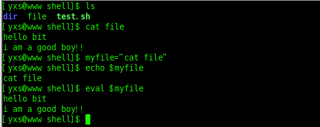
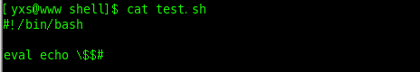

​												**shell中的eval命令**

eval命令用法：

​        当我们在命令行前加上eval时，shell就会在执行命令之前扫描它两次.eval命令将首先会先扫描命令行进行所有的置换，然后再执行该命令。该命令适用于那些一次扫描无法实现其功能的变量。该命令对变量进行两次扫描。

1. eval可以用来回显简单的变量：

​    

​    这样和普通的没有加eval关键字的命令的作用一样

 

2.eval也能用来执行含有字符串的命令：

​         首先我们先来创建一个file文件，在这个文件中输入一些我们想要输出的文本，然后我们将cat file赋给变量myfile，整个过程如下：

​       从上面我们可以看到，当我们把cat file直接赋予myfile变量后，我们直接echo myfile的内容将不会输出我们在file文件里面的文本。然后当我们用eval命令后，就会输出我们想要的内容。这时因为eval命令不但可以置换该变量，还能执行相应的命令。在第一次扫描中进行了变量置换，第二次扫描就执行了该变量所包含的字符串里面的cat file 命令，所以就输出了我们想要的内容。

 

3.eval命令还可以显示我们传递给脚本的最后一个参数：

​         我们现在有如下一个脚本：

​            

我们有如下的执行过程：

​       从上面的执行结果们可以看到，当我们执行该脚本时，结果总是我们输入的最后一个参数，这时怎么回事呢？这正是eval的这种用法，在上面的脚本中，eval命令首先把$$#解析为当前shell的参数个数（我们这里为4），然后再第二次扫描时才得出最后一个参数。

 

4.eval命令也可以创建指向变量的指针：

​      在上面的命令中，我们先定义了一个变量val=100；然后又定义了个ptr并把val赋予之。然后我们用eval命令来解析ptr的值，我们可以看到是100.然后我们通过ptr修改了val的值，此时再看val的值，就变成了50了。

---

shell中的eval命令 - 快乐嘉年华 - 博客园 - https://www.cnblogs.com/faberbeta/p/linuxshell_eval.html